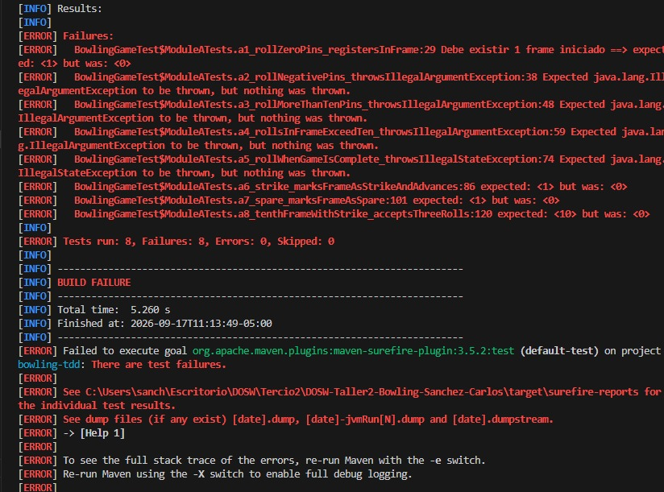
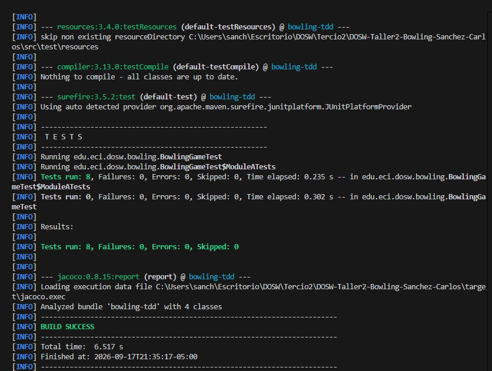
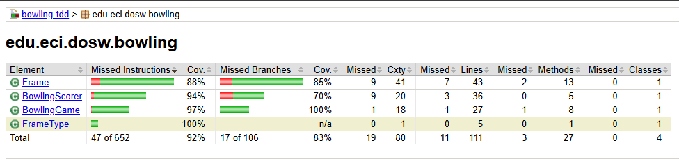
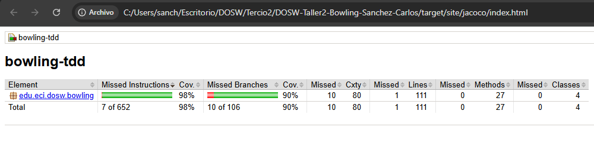
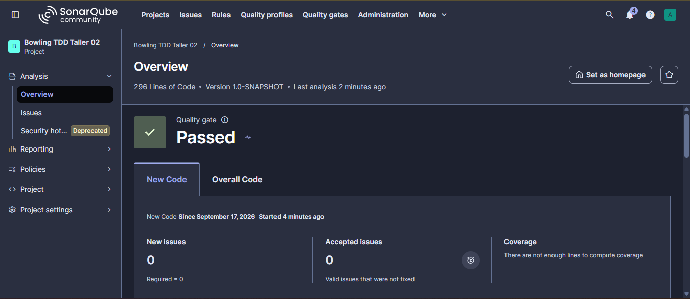

# Taller 2: Motor de Puntuacion de Bowling con TDD

## 1. Identificacion
Estudiante: Carlos Andres Sanchez Jimenez
Codigo: 1000104902
Correo institucional: carlos.sanchez-j@mail.escuelaing.edu.co
Asignatura: Desarrollo y Operaciones de Software (DOSW)

## 2. Descripcion del Sistema
BowlTech busca digitalizar el sistema de puntuacion en sus pistas de bolos para eliminar errores frecuentes en el calculo manual de bonificaciones por spare, strike y el manejo de los tiros adicionales en el decimo frame.

Este proyecto implementa el motor de puntuacion siguiendo las reglas oficiales del bowling mediante la metodologia TDD:
- Tiro normal: derriba una cantidad de pinos menor a 10 entre dos intentos. Se suman directamente los pinos obtenidos.
- Spare (/): se derriban los 10 pinos usando los 2 tiros del mismo frame. Otorga 10 puntos mas los pinos derribados en el primer tiro del siguiente frame.
- Strike (X): se derriban los 10 pinos en el primer tiro del frame. Se avanza al siguiente frame y se otorgan 10 puntos mas la suma de los dos tiros siguientes.
- Decimo frame: si el jugador consigue strike o spare en el decimo frame, tiene derecho a realizar hasta 3 tiros para completar sus bonificaciones.
- Juego perfecto: 12 strikes consecutivos que dan el puntaje maximo posible de 300 puntos.

Responsabilidades de las clases construidas en edu.eci.dosw.bowling:
- BowlingGame: motor principal del juego. Administra los 10 frames, recibe y valida cada tiro verificando rangos y estado del juego, y expone si el juego ya termino o cual es el puntaje final.
- Frame: modelo que encapsula los tiros individuales de un frame, determina su tipo y valida las restricciones de pinos para frames regulares y para el decimo frame.
- FrameType: enumeracion que define los tipos de frame posibles (NORMAL, SPARE, STRIKE y TENTH).
- BowlingScorer: calculador sin estado que toma la lista de frames y aplica el algoritmo de puntuacion acumulada considerando los bonos futuros correspondientes.

## 3. Evidencia TDD (Ciclo RED -> GREEN -> REFACTOR)
Durante el desarrollo del Modulo A (metodo roll) se aplico el ciclo estricto de desarrollo guiado por pruebas:

Fase RED: se crearon las pruebas unitarias para validar que roll rechazara valores negativos, mayores a 10, combinaciones mayores a 10 en un mismo frame y tiros adicionales cuando el juego ya finalizo. Al ejecutarlas sobre el codigo inicial, las pruebas fallaron como se esperaba.

Fase GREEN: se implemento la logica minima en Frame y BowlingGame para almacenar los tiros, actualizar el estado y lanzar las excepciones requeridas, logrando que todas las pruebas pasaran a verde.

Fase REFACTOR: se extrajeron constantes como MAX_PINS y STANDARD_FRAME_ROLLS, se descompuso el metodo de registro en addStandardRoll y addTenthFrameRoll, y se introdujeron metodos semanticos para mejorar la legibilidad del codigo sin alterar el comportamiento observado por las pruebas.

## 4. Cobertura de Codigo con JaCoCo
La cobertura fue medida y verificada utilizando el plugin de JaCoCo en Maven, con un umbral minimo exigido del 85% de lineas.

Reporte antes de pruebas adicionales:
En la primera fase con las pruebas iniciales de los modulos se alcanzo un 90.1% de cobertura en lineas y un 84.0% en ramas.

Reporte final:
Se agregaron pruebas para cubrir casos borde y metodos auxiliares en FrameTest y BowlingScorerTest, alcanzando un 99.1% de cobertura de lineas y 90.6% de ramas.

Pruebas que aumentaron la cobertura:
- Verificacion de calculo con colecciones de frames nulas o vacias en BowlingScorer.
- Validaciones en el decimo frame cuando se intentan tiros de bonificacion invalidos que exceden 10 pinos.
- Pruebas directas sobre el constructor por defecto y metodos accesorios de Frame y BowlingGame.

## 5. Analisis Estatico con SonarQube
El proyecto fue analizado con SonarQube Community levantado en contenedor Docker.

Resultados obtenidos:
- Estado de Quality Gate: Passed (OK)
- Cobertura reportada: 94.9%
- Bugs: 0
- Vulnerabilidades: 0
- Security Hotspots: 0
- Code Smells: 0

## 6. Pull Requests
El flujo de trabajo en Git se desarrollo creando la rama personal feature/SanchezCarlos_bowling a partir de develop, integrando los cambios exclusivamente mediante Pull Request.

- PR: Integracion modulo de Bowling TDD a develop
  Enlace: https://github.com/Carlossj8/DOSW-Taller2-Bowling-Sanchez-Carlos/pull/1
  Fecha: 17 de septiembre de 2026
  Modulos que cubre: configuracion Maven, Modulo A (roll), Modulo C (isComplete), Modulo B (score y calculate), pruebas de cobertura y ajustes de calidad.

## 7. Preguntas de Reflexion Tecnica

01. Que caso edge del Bowling fue el mas dificil de implementar con TDD y por que?
El caso mas complejo fue el decimo frame y su transicion de finalizacion. A diferencia de los primeros 9 frames donde un strike termina el frame de inmediato y un tiro normal siempre permite exactamente 2 intentos, el frame 10 altera la cantidad de tiros segun el resultado previo: puede requerir 2 tiros si es abierto, o habilitar un tercer tiro si hay strike o spare. Diseñar las pruebas para que BowlingGame.isComplete() y roll() reconocieran con precision cuando se debia permitir un tiro extra sin aceptar valores ilegales en los tiros de bonificacion requirio definir condiciones cuidadosas para no considerar el juego terminado antes de tiempo ni permitir tiros de mas.

02. Que parte del codigo cambio durante REFACTOR sin modificar el comportamiento observable?
Durante el refactor se reestructuro por completo el metodo addRoll de la clase Frame. Inicialmente contenia bloques de condiciones anidadas para diferenciar el decimo frame de los frames convencionales. En el refactor, esa logica se dividio en dos metodos privados independientes: addStandardRoll y addTenthFrameRoll. Asimismo, se reemplazaron los numeros magicos por constantes con significado de dominio (MAX_PINS, STANDARD_FRAME_ROLLS, TOTAL_FRAMES) y se introdujeron funciones de consulta semanticas como isStrike, isSpare y hasTenthFrameBonus. Toda la suite de pruebas continuo pasando sin alteracion alguna de la API publica.

03. Que casos de prueba descubriste al revisar el reporte de cobertura de JaCoCo que no habian considerado antes?
Al inspeccionar el reporte detallado en HTML de JaCoCo, identificamos ramas sin ejecutar correspondientes a manejo defensivo. Particularmente en BowlingScorer, el caso donde se pasa una lista nula o vacia no habia sido probado directamente. Tambien en Frame se detecto que faltaban pruebas para tiros bonus en el frame 10 donde, habiendo sacado un strike en el primer tiro y una cantidad menor a 10 en el segundo, el tercer tiro superara la cantidad de pinos restantes. Crear esas pruebas unitarias adicionales permitio elevar la cobertura de lineas del 90.1% al 99.1%.

04. Que hallazgo de SonarQube produjo un cambio real en el codigo?
El analisis de SonarQube reporto un problema de mantenibilidad (Code Smell) bajo la regla java:S1144, señalando que el metodo privado rollAllSpares en la clase BowlingGameTest no estaba siendo utilizado. Este metodo auxiliar se habia declarado inicialmente alli pero su uso real se habia trasladado a BowlingScorerTest. Al eliminar este metodo no referenciado, se removio el codigo muerto, dejando el proyecto con cero Code Smells y el Quality Gate completamente en verde.